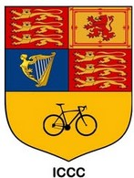

If you’re working on the website or posting on social media and need graphics – no need to install anything or pay for software. Just use **Photopea** and **Inkscape**. They’re free and easy to learn.

**Photopea** runs in your browser and works like Photoshop. Perfect for quick designs. All club logos are available in a single PSD file:  
[Download Logos.psd](Logos.psd)

**Inkscape** is a vector graphics tool. Great for logos, layouts, or clean scalable shapes. SVG is the standard format, and you can also export PNG or PDF.

## Example: New ICCC Logo

The current logo was built in Photopea. You can open the PSD to explore all layers and variations.

<!-- Large Logo Across Width -->

<!-- Three Logos Side by Side -->

  

    
  

  

    
  

  

    
  

## Old Logo Still in Use

The older design with the Imperial crest and bicycle is still part of the club’s identity. We now treat it as our **heritage logo** – used for merch, events, or when we want to tap into tradition.
