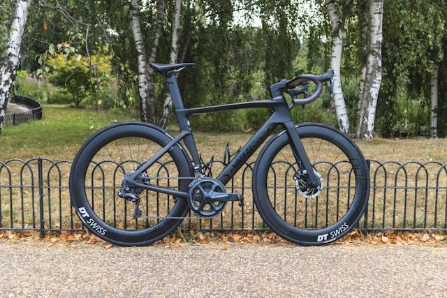

In recent years, bike fitting has developed into a full-blown industry — often accompanied by bold claims that your bike must be set up with millimeter precision. But is this really true?

We don’t think so. In fact, there are **no universal reference points** that could justify such surgical-level adjustments. Bike fit is highly individual and dynamic: you don’t ride in a lab — you ride on the road, adjusting your posture constantly, especially as fatigue sets in.

## The Myth of Millimeter-Perfect Fit

Turn on any professional cycling race, and you’ll notice it: even the pros often sit slightly crooked or shift position as they tire. The idea that there is one “correct” static position doesn’t hold up in the real world. Instead, **bike fit exists within a window** of acceptable parameters — not a single point.

That’s why, especially for beginners, it’s not worth spending large sums of money on an elaborate professional fitting. Your body needs time to adapt to cycling in general before an optimized fit can be meaningful. An exception might be for time trial setups, where extreme aero positions justify professional attention.

## Practical Bike Fit Advice

- **Saddle angle:** Keep it flat or slightly tilted forward. Avoid excessive tilt in either direction. Use a smartphone level app to measure.  
- **Saddle height:** Slightly too low is better than too high. A high saddle leads to hip instability and lost efficiency.  
- **Knee over pedal axle:** This is a very rough guideline and not a strict rule — listen to your body.  
- **Sliding on the saddle:** If you’re sliding forward or backward constantly, try adjusting saddle position accordingly.  
- **Reach to the handlebar:** If you feel overstretched, your frame might be too large — but sometimes a shorter stem is enough.  
- **Handlebar drop (saddle-to-bar height difference):** Beginners should keep it low — no more than 0–5cm initially.  
- **Cleat position:** Set them symmetrically and slightly farther back rather than too far forward.  

## Comfort Takes Time

Feeling uncomfortable at first is normal. You need to build proper pedaling technique and muscular adaptation. Indoor bikes (like Wattbikes at the gym) are a great way to practice form and make gradual changes.

> Listen to your body. Small aches can be normal; sharp pain or numbness should never be ignored.

## Handling Discomfort

- **Saddle pain:** If it’s on the sit bones, that’s usually harmless. Try different shorts, saddle shapes, or just give your body time.  
- **Soft tissue pain:** Be cautious. If there's no relief with adjustments, stop training and reassess.  
- **Back or neck pain:** This often reflects weak supporting muscles. Targeted strength training can help significantly.  
- **Knee pain or other joint issues:** These can have many causes — don’t hesitate to consult a physiotherapist if problems persist.  

## Watch: Practical Bike Fitting Tips



## Can We Help You with Bike Fitting?

Absolutely. If you're just starting out, our cycling club can support you with basic bike setup advice — no overcomplication, just practical tips based on experience.

Remember, **comfort, adaptation, and consistency** are more important than finding a “perfect” setting from day one. You and your bike will grow together.

