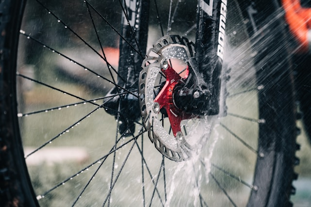

Let's face it—cleaning your bike is one of those tasks that often gets neglected, especially if you don’t have access to a hose or yard. If you're stuck in student housing without outdoor space, washing becomes tricky. One simple solution: limit your rides to dry days. This alone can significantly reduce how often you need to clean your bike.

If you're unsure about how to wash your bike properly, we recommend checking out this [YouTube guide](https://www.youtube.com/watch?v=DifcPmKyPYs).

For cleaning, a basic all-purpose household cleaner will do the job. However, be extra careful around your disc brakes—getting any oil on them can ruin braking performance.

Chain cleaning is a bit of a controversial topic. While degreasers will get your chain spotless, some argue they can strip away the internal lubrication. For lubrication, stick with a simple chain oil. Avoid heavy-duty products for very wet conditions — they contain Teflon, which is both environmentally unfriendly and messy. Once applied, it’s almost impossible to clean off.

Other than that, you don’t need fancy care products. Less is often more.

## Maintenance & Repairs

With a bit of mechanical intuition, most bike repairs can be done yourself. YouTube is full of great tutorials. While we can’t offer a full repair service, we’re always happy to offer advice or help if we can.
