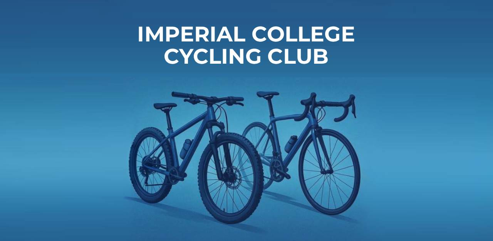

The new Imperial College Cycling Club website started as a prototype — a test of how quickly a modern website could be built using templates and tools like ChatGPT. What began as a technical experiment soon turned into a real club project, as the idea sparked interest and support within the cycling community.

While initially a personal project, the website soon developed into a proper design and communication platform for the club. Beyond technical implementation, the work involved article writing, visual design, and some deeper thought about what role a club website should play — both functionally and as a reflection of club culture.

Modern cycling culture is evolving, with strong influences from design, fashion, and lifestyle. This shift has been embraced by brands like Rapha, MAAP, and Pas Normal Studios. Inspired by that, the ICCC website was designed not just to be functional but to visually align with contemporary cycling aesthetics. The goal is to help ICCC present itself as an open, modern, and active part of Imperial’s student life.

Club culture plays an important role at universities like Imperial. It helps build community, enriches student life, and offers continuity between generations of students. That’s why a strong online presence — from the website to social media — can make a real difference. It helps students discover the club, understand what it offers, and feel welcome.

Despite the new website and growing visibility, the Imperial College Cycling Club (ICCC) still faces challenges that contribute to low member numbers. The club’s vision is to make cycling more accessible, grow membership, and develop a clear strategy for the future. The website acts as a first step in this process, providing a modern platform to showcase the club's activities, values, and opportunities.

Importantly, the ICCC aims to attract not only students interested in BUCS road competitions, but also those who see cycling as a lifestyle, a balance to everyday life, or a sustainable form of city mobility. By combining a strong online presence with practical solutions for accessibility and engagement, the club hopes to connect with a wider community and strengthen its role within Imperial’s student life.

## 1. Communication and Appearance

The club needs a stronger identity and better communication.

- **Accessible Information**  
  We have created a new website that highlights different aspects of cycling and makes information more accessible. It will serve as the main platform for news and club offers.

- **Style and Cycling Culture**  
  ICCC should present cycling more as a lifestyle topic, focusing on style and everyday cycling culture. At the moment, the club has no real design, a poor logo, and very little Instagram activity. This needs improvement.

- **Club Hoodie**  
  A new hoodie will make the club more visible on campus and strengthen identity.

- **Road Kit**  
  The current road kit is poorly designed. We want to create a new one with a modern pro team look. If needed, also an MTB jersey.

## 2. Club Facilities and Bikes

Most students live in small rooms with very limited space. This makes storing, repairing, or cleaning a bike a real challenge. Without these possibilities, cycling is hardly possible in London.

- **ICCC Bike Workshop**  
  We want to set up a workshop where members can clean and repair their bikes. The “Bike Users Group” had a workshop until last year – ICCC could take it over. A bike wash with hose and drainage should also be included.

- **Bike Storage**  
  It would be useful to offer bike storage by securing our own space, for example a shed in a campus bike parking area.

- **2 Club Hardtail MTBs**  
  The club should purchase two hardtail MTBs. These would give students the chance to try the sport if the high purchase price is holding them back. They would also help members who do not have storage space in London.  
  Hardtails are ideal as club bikes because they are:
  - versatile (good for MTB activities and also XC training, which is closely linked to road cycling),
  - robust (no fragile carbon fork),
  - easy to maintain,
  - simple to handle,
  - cheaper than other categories of bikes.

They could, for example, be stored in the Faculty Building Bike Park. Club mountain bikes would also benefit exchange students who only stay in London for a short time and freshers who want to try cycling.

To support this, the club could create a *Workshop and Materials Manager* position for a dedicated student to take responsibility for the workshop and club bikes.

## 3. Indoor Cycling

The challenges of London life make cycling even harder: high rent, little space, far distances to nature, and academic terms from autumn to spring, which skip the main cycling season. Cycling also takes more time than, for example, a quick evening run in Hyde Park.

- **Indoor Cycling Offers**  
  We want to provide indoor cycling training so members can continue riding even in winter or with limited time.

- **Overview of Existing Indoor Bikes**  
  Together with Imperial Athletes, we should create an overview of where modern indoor bikes are available (e.g., Wattbikes in Ethos and Weights Club, Boat House, other gyms).

- **Expanding Capacity**  
  We should explore whether new indoor bikes can be purchased to expand capacity and where they could be placed.

- **Prioritised Access for ICCC Members**  
  It would be helpful to arrange reserved times or dedicated Wattbike access for ICCC members, possibly even without a full gym membership. Alternatively, ICCC could look for a room to place two Wattbikes exclusively for club use.

- **Existing Spinning Bikes**  
  We need to gather information about the existing spinning bikes:  
  – Are they suitable for indoor cycling training?  
  – Do they measure power (watts)?  
  – Can ICCC members access them outside of official spinning classes?

## 4. Cross-Club Endurance Sports Offers

Currently, ICCC and the IC Triathlon Club sometimes compete with overlapping cycling offers. A partnership would make sense to strengthen both clubs.

- **Club Partnership: Joint Offers with Triathlon Club**  
  We could combine offers through cooperation: shared group rides, joint spinning sessions, and joint training opportunities.

- **Cross-Club Endurance Sport Support**  
  Under the umbrella of Imperial Athletes, different offers could be made for endurance athletes:

- **Strength Training**  
  Provide strength training introductions for endurance athletes. Strength Training is an important part of cycling, and beginners should learn the correct techniques under guidance.

- **Nutrition and Training Seminars**  
  Provide seminars or online courses on nutrition and endurance training methods together with other Imperial Athletes clubs.

- **Promoting the Benefits of Strength and Endurance Training**  
  A healthy mind lives in a healthy body. At university, physical activity is often neglected because the focus is heavily on academics. However, the benefits of sports are immense, improving both mental well-being and physical performance, which in turn supports academic success.

## 5. Clear Safety Concept

Cycling has risks. Riders are exposed to traffic, accidents can happen, and mechanical failures are always possible. To make members feel safe, the club needs a clear safety strategy.

- **Insurance**  
  Provide information about useful insurance cover for cyclists.

- **Emergency Pickup**  
  Explore options for an emergency pickup service in case of accidents or breakdowns, to bring rider and bike home.

- **Road Safety**  
  Offer training and guidance on road safety for group rides and city cycling.

## 6. Alumni

Many people only discover cycling after their university years. Alumni can bring valuable experience to group rides and strengthen the club community.

- **Alumni Engagement & Tiered Membership**  
  Develop strategies to better involve alumni and invite them to join rides or club activities.

- **Tiered Membership**  
  Introduce a tiered membership model that includes alumni and reflects the different activity levels within the club.

## Conclusion

The Imperial College Cycling Club has huge potential. With a clear vision, stronger communication, new equipment, indoor training, and collaborations, we can make cycling accessible to more students and grow our membership.

*Our goal is simple: show that ICCC is not just about racing, but also about lifestyle, community, and the joy of cycling.*
