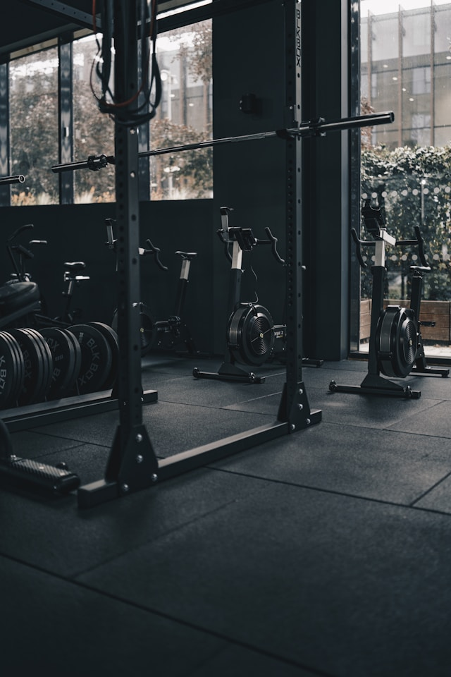

Thanks to the easy availability of heart rate tracking via smartphones and smartwatches, and GPS-based speed and distance tracking, the topic of training methods has gained significant traction over the past decades. Easier access to training data and know-how through platforms like YouTube has made it much more feasible for people to improve their performance and take their fitness to the next level. As a result, cycling and triathlon have become more popular than ever.

If you have any ambitions in endurance sports, it's well worth learning about training methodology and building your own training plan. ChatGPT and YouTube are both excellent starting points. Questions like “What is Zone 2, the thing everyone’s talking about?” or “Rest day or active recovery?” can now be answered easily. In the end, consistency is key. Don't get discouraged by setbacks or by others who may start at a higher fitness level. Progress takes time, and everyone’s starting point is different.

Collect experience: try out different training approaches, but also learn to listen to your body. The consistency will pay off — with better performance, improved mental clarity, natural mood boosts, stress relief, better health, a longer life expectancy, and even better looks and confidence. But sport follows the rule: less is often more. That might sound counterintuitive, as you’d think the hardest-working person always wins — but especially beginners tend to overtrain, which can lead to exhaustion, performance drops, or injury.

To avoid injury and support your progress, include strength and mobility training. Heavy compound lifts like squats and deadlifts can actually benefit endurance athletes too. It takes time to develop proper technique and body awareness here, but the long-term benefits are substantial. Resistance training is currently a hot topic, and for good reason — it’s incredibly beneficial for overall health.

Nutrition is just as important as training and recovery. After training, it's essential to quickly replenish your carbohydrate stores. Also make sure to fuel with enough carbs before and during workouts to sustain performance — fat burns in the fire of carbohydrates. Without carbs, your performance will drop quickly.

In general, avoid overly processed food and aim for a balanced diet with sufficient protein. Endurance athletes should eat a carb-rich diet: rice, pasta, bread, fruit, etc. Even high sugar intake can be beneficial for endurance athletes as long as it’s balanced with training. Nutrition is a complex field where each person must find what works for them. One quote from a TED Talk on YouTube stuck with me: “Only 50% of what’s said in nutrition science is true. The problem is, we don’t know which 50%.”

If you’re interested in training plans or methods, feel free to reach out. The New York Times (which Imperial students can access) also publishes great articles about running — many of which are relevant for cycling, too.

**Beginner Training Plan:**  
If you want to make real progress in endurance sports, you need volume to build your aerobic base. Aim for at least 3 sessions a week of Zone 2 training (around 1 hour each) doing a sport you enjoy — like cycling or running. Zone 2 means going at a conversational pace. Exact heart rate formulas aren’t that useful, as heart rate can vary a lot depending on the day — especially for beginners.

The most important thing is that you enjoy it and don’t overdo it. In the beginning, even 20 minutes of cycling or running is enough to start adapting. Once you’ve built a base, interval training can be added to boost performance. Supplement with strength training and mobility work (like stretching or foam rolling). Most people find it difficult to follow a structured program alongside demanding studies — and that’s okay. Even a little bit of movement makes a big difference. You might have more time to focus on structured training later in life.

It’s also essential to have alternatives to outdoor cycling — like running or indoor cycling (see our indoor training section). This way, you stay flexible with your training, regardless of the weather, and can easily fit sessions into your day to reach your training goals.
