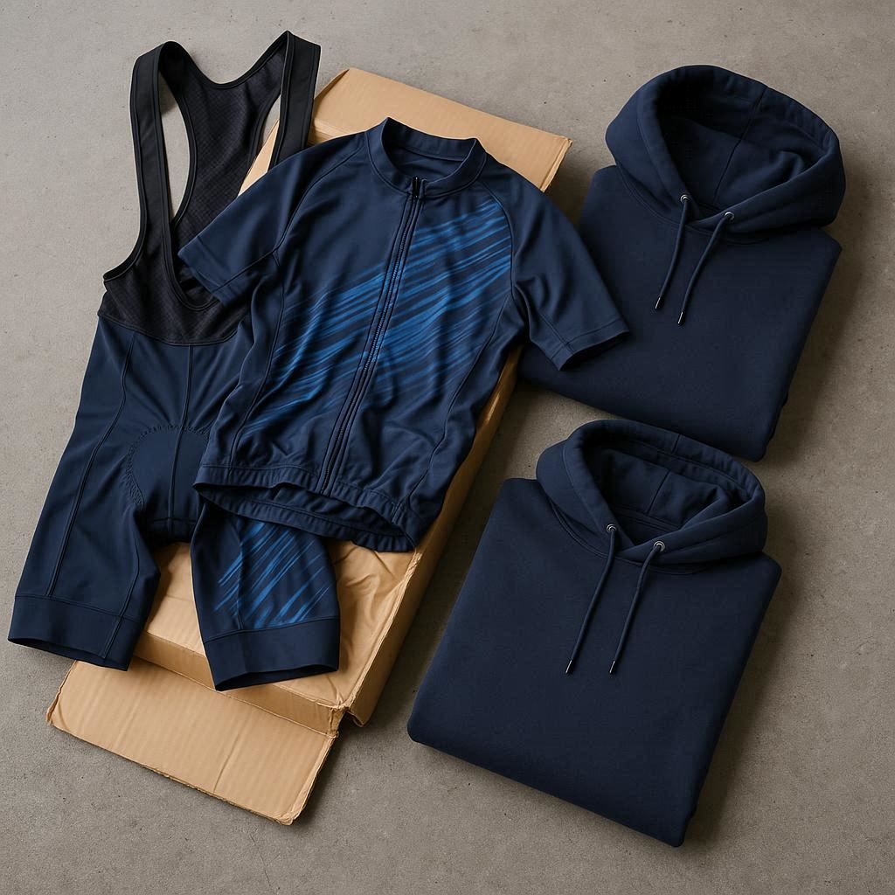

**Download the complete bundle (Markdown + images) here:**  
[Download example blog post bundle](https://github.io/iccycling/blog/content/posts/2025/creating-blog-posts)

---

Welcome! This is a **full example blog post** showing common elements you might want to include in a post. You can use this as a template for your own posts.

## Why Create Structured Posts?

Creating posts with a clear structure ensures:

- Consistency across posts  
- Easy readability  
- Proper rendering in Hugo and on the main website  

---

## Headings

You can use different heading levels:

### H3 Example

Subsections are useful for breaking content into manageable pieces.

#### H4 Example

Even smaller subsections work for detailed explanations.

---

## Lists and Code

### Unordered List

- Item 1
- Item 2
    - Subitem 2a
    - Subitem 2b
- Item 3

### Ordered List

1. Step one
2. Step two
3. Step three

### Inline Code

You can highlight code inline with backticks, e.g., `hugo server`.

### Code Block

    ```bash
    # Start Hugo server in blog folder
    cd blog
    hugo server
    ```

---

## Images and Captions

### Single Image with Caption

<figure>
  
  <figcaption>
    AI Generated Cycling Kit Pic (Bing Image Creator)
  </figcaption>
</figure>

### Single Image with Caption in a smaller Size

<figure>
  
  <figcaption>
    AI Generated MTB Wear Pic (Bing Image Creator)
  </figcaption>
</figure>

### Gallery with Captions



---

## Quotes

> This is an example quote.  
> Hugo will render it nicely in the blog with proper formatting.

---

## Tips for local Testing

1. **Download the ZIP bundle** from the link above. It contains:
    - `index.md` (this post)  
    - `pic1.jpg`, `pic2.png`,... all images used in the post
2. Install Hugo (recommended version: 0.149)
3. Copy your `index.md` and images into `content/posts/2025/your-post/...`
4. Run the Hugo server in the blog folder:

    ```bash
    hugo server
    ```

5. Open in browser: [http://localhost:1313/blog/posts/](http://localhost:1313/blog/posts/2025/)
6. After changes, you may need to restart `hugo server`.

## Tips for local Testing

Just send uns your folder containing `index.md` and the images and we can put it online
---


- If you are not comfortable with Hugo, you can simply send us the text and images. We will handle the upload and publishing.

---

Enjoy writing your posts! 🎉
